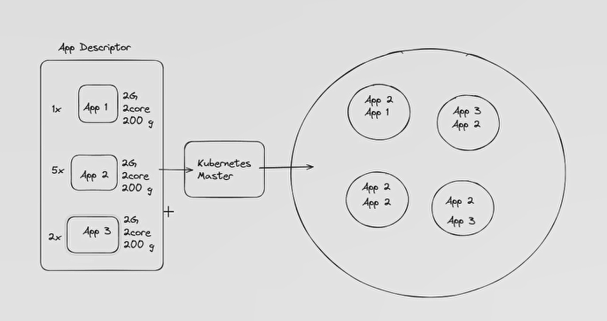
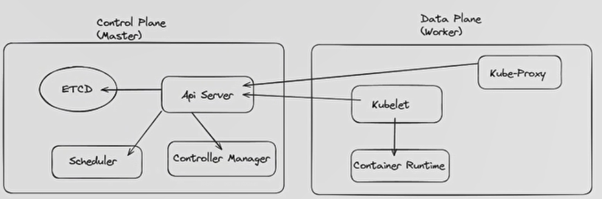

# Chapter 1 - Introducing Kubernetes

## 1.1 Monolithic VS Microservice

## 1.2 The Need of Orchestrator

The name "Kubernetes" originates from the Greek which means governor, helmsman or pilot.

- scaling
- migration monolith to microservice

## 1.3 Migrating to DevOps

- Automation application Deployment
- Deployment strategies
- Load balancing

## 1.4 Docker & ContainerD

- CRI:  Container Runtime Interface
  - standard for interface of container runtime
- OCI: Open Container Initiator
  - standards and specification for containers and images

Docker, Podman, RKT, CRI-O, ContainerD,

## 1.5 Kubernetes Architecture

A software to deploy and manage our application.

App descriptor: Manifest --> to define and introduce an app for k8s in `yaml` format. We send this `yaml` file to `master`'s of Kubernetes.

we have two part in k8s:

1. Control plane = Master
   *  Controlling, management, administration parts

2. Data Plane = Worker

  - Deployment area

Master components:

1. **etcd**: a key value database, open source, secure, fast, scalable, it stores all manifests
2. **Scheduler**: it decides that which container deploy in which sever
3. **Controller Manager**: We have several controller in k8s and it manages all controllers.
4. **API Server**: We as user of k8s work with API Server not other components.

Workers Components:

1. **Kubelet**: its a systemd service on worker nodes to manage workers. it communicates with API Server in master nodes and communicates with container runtime in worker node.
2. **Kube-Proxy**: It relates to network things. It communicate directly with API server.  

we must have an image repository to pull (download) images.

Kubernetes has self healing.