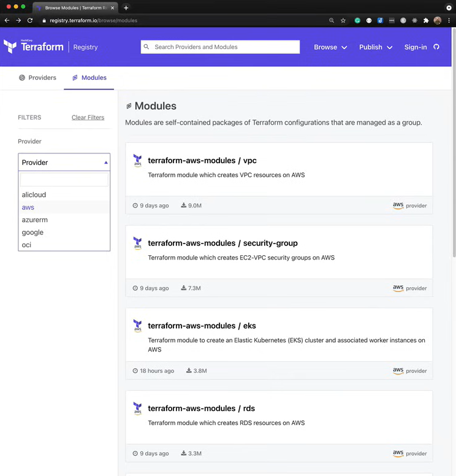

[TOC]

# 06: Project Organization + Modules

## 6.1 What is a Module?

Modules are containers for multiple resources that are used together. A module consists of a collection of `.tf` and/or `.tf.json` files kept together in a directory.

Modules are the main way to package and reuse resource configurations with Terraform. (Used across different projects or different environments or share the module if you think third parties might find them useful)

## 6.2 Why Modules?

You can't expect everyone to know everything, and in order to make something like a team manageable we need to break down the system into different components. For example, an infrastructure team in a company makes abstractions of deployment of applications for application developers of the company.

## 6.3 Types of Modules

### 6.3.1 Root Module

Default module containing all `.tf` files in main working directory

### 6.3.2 Child Module

A separate external module referred to from a `.tf` file.

## 6.4 Module Sources

- Local paths
- Terraform Registry
- GitHub
- Bitbucket
- Generic Git, Mercurial repositories
- HTTP URLs
- S3 buckets
- GCS buckets

### 6.4.1 Local Path

You would just use a relative path from your root module to wherever that child module lives.

```terraform
module "web-app" {
    source = "../web-app"
    }
```

### 6.4.2 Terraform Registry

The source would be whatever organization then slash `/` and then the name of module, and you can pin a version.

```terraform
module "" {
    source ="hashicorp/consul/aws"
    version = "0.1.0"
    }
```

### 6.4.3 Github

```terraform
# HTTPS
module "example" {
    source ="github.com/hashicorp/example?ref=v1.3.1" # can reference specific version
    }

module "example" {
    source ="git@github.com:hashicorp/example.git"
    }
```

### 6.4.4 Generic Git Repository

```terraform
module "example" {
    source ="git::ssh//username@example.com/storage.git"
    }
```

## 6.5 Inputs + Meta-Arguments

- Input variables are passed in via module block

**Meta-Arguments:**

- count
- for_each
- providers
- depends_on

```terraform
module "web-app" {
    source ="../web-app-module"

    # Input Variables
    bucket_name = "devops-directive-web-app-data"
    domain      = "mysuperawesomesite.com"
    db_name     = "mydb"
    db_user     = "foo"
    db_pass     = var.db_pass
    }
```

## 6.6 What Makes a Good Module?

- Raises the abstraction level from base resource types
- Groups resources in a logical fashion
- Exposes input variable to allow necessary customization + composition
- Provides useful defaults (makes onboarding experience much nicer)
- Provides useful defaults Returns outputs to make further integrations possible

## 6.7 Terraform Registry

You can use Terraform Registry as starting point.



## 6.8 Consuming a 3rd-party Module

### 6.8.1 Example 1: Consul

We will deploy Consul with [AWS Consul Module](https://registry.terraform.io/modules/hashicorp/consul/aws/latest) from Terraform registry. We can take advantage of them, configuring the system with a lot of the best practices and exposing the input variables to us. They abstracted away a lot of the complexity that would be required to run Consul.

> main.tf

```terraform
terraform {
    # Assume s3 bucket and dynamo DB table already set up
    backend "s3" {
        bucket         = "devops-directive-tf-state"
        key            = "06-organization-and-modules/consul/terraform.tfstate"
        region         = "us-east-1"
        dynamodb_table = "terraform-state-locking"
        encrypt        = "true"
        }
    required_providers {
        aws = {
            source = "hashicorp/aws"
            version = "~> 3.0"
            }
        }
    }

provider "aws" {
    region = "us-east-1"
    }

module "consul"{
    source = "git@github.com:hashicorp/terraform-aws-consul.git"
    }
```

After that you must run `terraform init` and then `terraform plan` then you will see this actually provision 52 different resources within our AWS account, things ranging from ec2 instances to networking policies to IAM roles.

### 6.8.2 Example 2: Web-app

> the project tree:
>
> .
> ├── web-app
> ├── web-app-module
> web-app/main.tf

```terraform
terraform {
  # Assumes s3 bucket and dynamo DB table already set up
  backend "s3" {
    bucket         = "devops-directive-tf-state"
    key            = "06-organization-and-modules/web-app/terraform.tfstate"
    region         = "us-east-1"
    dynamodb_table = "terraform-state-locking"
    encrypt        = true
  }

  required_providers {
    aws = {
      source  = "hashicorp/aws"
      version = "~> 3.0"
    }
  }
}

provider "aws" {
  region = "us-east-1"
}

variable "db_pass_1" {
  description = "password for database #1"
  type        = string
  sensitive   = true
}

variable "db_pass_2" {
  description = "password for database #2"
  type        = string
  sensitive   = true
}

module "web_app_1" {
  source = "../web-app-module"

  # Input Variables
  bucket_prefix    = "web-app-1-data"
  domain           = "devopsdeployed.com"
  app_name         = "web-app-1"
  environment_name = "production"
  instance_type    = "t2.micro"
  create_dns_zone  = true
  db_name          = "webapp1db"
  db_user          = "foo"
  db_pass          = var.db_pass_1
}

module "web_app_2" {
  source = "../web-app-module"

  # Input Variables
  bucket_prefix    = "web-app-2-data"
  domain           = "anotherdevopsdeployed.com"
  app_name         = "web-app-2"
  environment_name = "production"
  instance_type    = "t2.micro"
  create_dns_zone  = true
  db_name          = "webapp2db"
  db_user          = "bar"
  db_pass          = var.db_pass_2
}
```

> our module tree:
>
> .
> ├── compute.tf
> ├── database.tf
> ├── dns.tf
> ├── main.tf
> ├── networking.tf
> ├── outputs.tf
> ├── storage.tf
> └── variables.tf
>
> 1 directory, 8 files
> main.tf

```terraform
terraform {
  required_providers {
    aws = {
      source  = "hashicorp/aws"
      version = "~> 3.0"
    }
  }
}
```

> outputs.tf

```terraform
output "instance_1_ip_addr" {
  value = aws_instance.instance_1.public_ip
}

output "instance_2_ip_addr" {
  value = aws_instance.instance_2.public_ip
}

output "db_instance_addr" {
  value = aws_db_instance.db_instance.address
}
```

> variables.tf

```terraform
# General Variables

variable "region" {
  description = "Default region for provider"
  type        = string
  default     = "us-east-1"
}

variable "app_name" {
  description = "Name of the web application"
  type        = string
  default     = "web-app"
}

variable "environment_name" {
  description = "Deployment environment (dev/staging/production)"
  type        = string
  default     = "dev"
}

# EC2 Variables

variable "ami" {
  description = "Amazon machine image to use for ec2 instance"
  type        = string
  default     = "ami-011899242bb902164" # Ubuntu 20.04 LTS // us-east-1
}

variable "instance_type" {
  description = "ec2 instance type"
  type        = string
  default     = "t2.micro"
}

# S3 Variables

variable "bucket_prefix" {
  description = "prefix of s3 bucket for app data"
  type        = string
}

# Route 53 Variables

variable "create_dns_zone" {
  description = "If true, create new route53 zone, if false read existing route53 zone"
  type        = bool
  default     = false
}

variable "domain" {
  description = "Domain for website"
  type        = string
}

# RDS Variables

variable "db_name" {
  description = "Name of DB"
  type        = string
}

variable "db_user" {
  description = "Username for DB"
  type        = string
}

variable "db_pass" {
  description = "Password for DB"
  type        = string
  sensitive   = true
}


```

> compute.tf

```terraform
resource "aws_instance" "instance_1" {
  ami             = var.ami
  instance_type   = var.instance_type
  security_groups = [aws_security_group.instances.name]
  user_data       = <<-EOF
              #!/bin/bash
              echo "Hello, World 1" > index.html
              python3 -m http.server 8080 &
              EOF
}

resource "aws_instance" "instance_2" {
  ami             = var.ami
  instance_type   = var.instance_type
  security_groups = [aws_security_group.instances.name]
  user_data       = <<-EOF
              #!/bin/bash
              echo "Hello, World 2" > index.html
              python3 -m http.server 8080 &
              EOF

```

> database.tf

```terraform
resource "aws_db_instance" "db_instance" {
  allocated_storage   = 20
  storage_type        = "standard"
  engine              = "postgres"
  engine_version      = "12"
  instance_class      = "db.t2.micro"
  name                = var.db_name
  username            = var.db_user
  password            = var.db_pass
  skip_final_snapshot = true
}
```

> dns.tf

```terraform
resource "aws_route53_zone" "primary" {
  count = var.create_dns_zone ? 1 : 0
  name  = var.domain
}

data "aws_route53_zone" "primary" {
  count = var.create_dns_zone ? 0 : 1
  name  = var.domain
}

locals {
  dns_zone_id = var.create_dns_zone ? aws_route53_zone.primary[0].zone_id : data.aws_route53_zone.primary[0].zone_id
  subdomain   = var.environment_name == "production" ? "" : "${var.environment_name}."
}

resource "aws_route53_record" "root" {
  zone_id = local.dns_zone_id
  name    = "${local.subdomain}${var.domain}"
  type    = "A"

  alias {
    name                   = aws_lb.load_balancer.dns_name
    zone_id                = aws_lb.load_balancer.zone_id
    evaluate_target_health = true
  }
}
```

> networking.tf

```terraform
data "aws_vpc" "default_vpc" {
  default = true
}

data "aws_subnet_ids" "default_subnet" {
  vpc_id = data.aws_vpc.default_vpc.id
}

resource "aws_security_group" "instances" {
  name = "${var.app_name}-${var.environment_name}-instance-security-group"
}

resource "aws_security_group_rule" "allow_http_inbound" {
  type              = "ingress"
  security_group_id = aws_security_group.instances.id

  from_port   = 8080
  to_port     = 8080
  protocol    = "tcp"
  cidr_blocks = ["0.0.0.0/0"]
}

resource "aws_lb_listener" "http" {
  load_balancer_arn = aws_lb.load_balancer.arn

  port = 80

  protocol = "HTTP"

  # By default, return a simple 404 page
  default_action {
    type = "fixed-response"

    fixed_response {
      content_type = "text/plain"
      message_body = "404: page not found"
      status_code  = 404
    }
  }
}

resource "aws_lb_target_group" "instances" {
  name     = "${var.app_name}-${var.environment_name}-tg"
  port     = 8080
  protocol = "HTTP"
  vpc_id   = data.aws_vpc.default_vpc.id

  health_check {
    path                = "/"
    protocol            = "HTTP"
    matcher             = "200"
    interval            = 15
    timeout             = 3
    healthy_threshold   = 2
    unhealthy_threshold = 2
  }
}

resource "aws_lb_target_group_attachment" "instance_1" {
  target_group_arn = aws_lb_target_group.instances.arn
  target_id        = aws_instance.instance_1.id
  port             = 8080
}

resource "aws_lb_target_group_attachment" "instance_2" {
  target_group_arn = aws_lb_target_group.instances.arn
  target_id        = aws_instance.instance_2.id
  port             = 8080
}

resource "aws_lb_listener_rule" "instances" {
  listener_arn = aws_lb_listener.http.arn
  priority     = 100

  condition {
    path_pattern {
      values = ["*"]
    }
  }

  action {
    type             = "forward"
    target_group_arn = aws_lb_target_group.instances.arn
  }
}


resource "aws_security_group" "alb" {
  name = "${var.app_name}-${var.environment_name}-alb-security-group"
}

resource "aws_security_group_rule" "allow_alb_http_inbound" {
  type              = "ingress"
  security_group_id = aws_security_group.alb.id

  from_port   = 80
  to_port     = 80
  protocol    = "tcp"
  cidr_blocks = ["0.0.0.0/0"]

}

resource "aws_security_group_rule" "allow_alb_all_outbound" {
  type              = "egress"
  security_group_id = aws_security_group.alb.id

  from_port   = 0
  to_port     = 0
  protocol    = "-1"
  cidr_blocks = ["0.0.0.0/0"]

}


resource "aws_lb" "load_balancer" {
  name               = "${var.app_name}-${var.environment_name}-web-app-lb"
  load_balancer_type = "application"
  subnets            = data.aws_subnet_ids.default_subnet.ids
  security_groups    = [aws_security_group.alb.id]

}
```

Hopefully that gives you an idea of how we can break up our Terraform code into relevant sections, so it's:

- Easier to follow and easier to read.
- Parametrizing it with variables so that we can pass in key information to differentiate between different environments.
- Abstracts a lot of complexity within that module, so as a consumer of the module we just pick the key values that we want to pass in.
- We can provision one or more copies of that module very easily.
