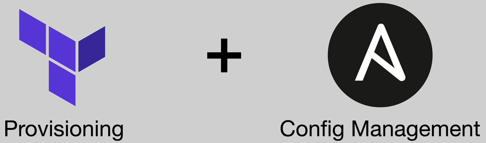
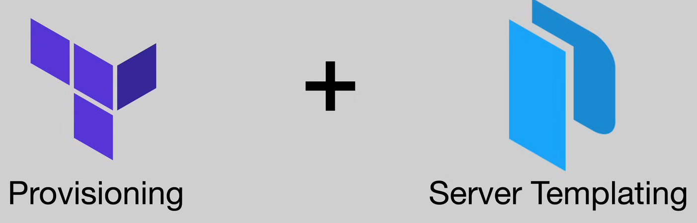
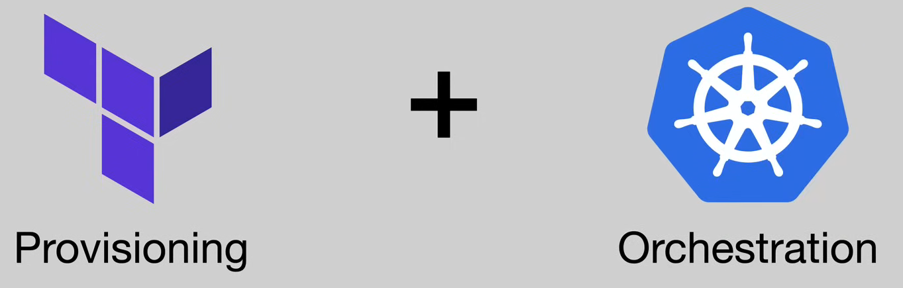
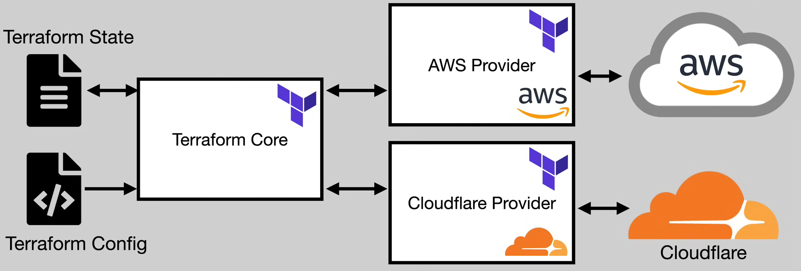
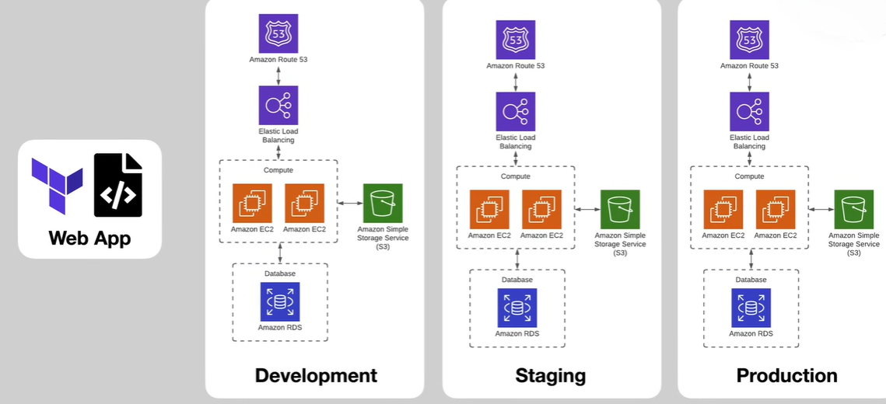

[TOC]


# What is Terraform?

Terraform is a tool for building, changing, and versioning infrastructure safely and efficiently.

IaC tools allow you to define your entire cloud infrastructe as a set of config files which then the tool terraform can go off and interact with the cloud provider api and provision and manage on our behalf.

# Course Overview

1. Evolution of Cloud + Infrastructure as Code
  
2. Terraform overview + Setup
  
3. Basic Terraform Usage
  
4. Variables and Outputs
  
5. Language Features
  
6. Project Organization + Modules
  
7. Managing Multiple Environments
  
8. Testing Terraform Code
  
9. Developer Workflows


# 1: Evolution of Cloud + Infrastructure as Code

## 1.1 Historical Overview

### 1.1.1 Pre-Cloud (1990s --> 2000s)

- Buy bunch of servers (physical servers)
  
- Setting up datacenter (handle all power management and networking and ...)
  

### 1.1.2 Cloud (2010s --> Now)

- Rather than provision your server, deploy your app to the cloud
  
- the cloud it's become pretty much the de facto standard
  
- On-demand resource
  

## 1.2 What has changed?

- Infrastructure provisioned via APIs
  
- Servers created & destroyed in seconds
  
- Long-lived + mutable --> Short-lived + Immutable

each individual unit is the short-lived immutable thing that we're never gonna change. (It's a paradigm shift of thinking about infrastructre of apps)

## 1.3 Provisioning Cloud Resources

Three Approaches:

* GUI: By clicking
* API/CLI: `aws ec2 new`, its more programmatically
* IaC: Define infrastructure in codebase

## 1.4 What is Infrastructure as Code (IaC)?

Categories of IaC tools:

1. **Ad hoc scripts**: like a bash script that calls AWS to provision five ec2 instances
2. **Configuration Management tools**: like Ansible, Puppet or chef, they are really positioned to manage the software that is running and configuration of infrastructure, and these are more suited for on-perm setups where you're provisioning some hardware and then you need to manage what software is installed and how those are configured
3. **Server Templating tools:** This category is building out a template for what you're going to provision onto a server. `AMI`, Amazon Machine Image or any virtual machine image is provisioned from some template and you can build in all your dependencies into that template. You can build that template and you can spawn multiple copies of the same server over and over.
4. **Orchestration tools:** The most popular these days in terms of orchestration tools is Kubernetes which is for orchestrating containers. These are for how define your application deployment.
5. **Provisioning tools:** Provisioning those cloud resources to begin with, and important thing to call out here is the concept of declarative versus imperative. 

### 1.4.1 Declarative vs. Imperative

* Declarative tools: You define the end state of what you want, example: 5 servers 1 load balancer 1 s3 bucket etc, and the tool manages what API calls need to be made and how to actually make that happen.
* Imperative tools: You tell the system what you want to happen and the sequence in which you want them to happen.

A lot of configuration management tools for fall more on the imperative side, they do offer some utilities to make them more declarative and make those scripts idempotent, so you can run them multiple times. But a lot of provisioning tools which terraform falls into they are primarily on the declarative side so you specify the end state you want your infrastructure to take, and then you let the tools handle the details of how to actually get there

## 1.5 IaC Provisioning Tools Landscape

### 1.5.1 Cloud Specific

* AWS Cloud Formation
* Azure Resource Management
* Google Cloud Deployment Manager

Provided by major cloud provider and focusing on provisioning infrastructure within that cloud. You are out of luck if you want provision something out of that cloud or another cloud if you use one of them like Cloud Formation.

### 1.5.2 Cloud Agnostic

They can use across any cloud provider. They can interact with almost anything with and API online. Use cases are like if you have your application deployed across multiple clouds or you want to be able to use auxiliary services like Cloudflare or Atlas for MongoDB

* Terraform
* Pulumi

# 2: Terraform Overview + Setup

## 2.1 What is Terraform

* Terraform is a tool building, changing, and versioning infrastructure safely and efficiently
* Enables application software best practices to infrastructure
* Compatible with many clouds and services (Cloud-agnostic)

## 2.2 Common Patterns



We have our setup and terraform is going to provision a number of virtual machines for us, then we could take a tool like ansible and install all the necessary dependencies inside of those virtual machines.



In this case Terraform provisions the servers and Packer is used to build the image from those virtual machines are created, rather than provisioning and then installing and configuring like we were with ansible, now we can pre-package all of that into a machine image that we can provision copies of with Terraform. 

We can actually even build our application code into that server template; so that once it's provisioned, not only does it have all the dependencies, it also has our application bundled right in.



In this case we using Terraform to provision our Kubernetes clusters, maybe it's a managed cluster like EKS in AWS or maybe a self-managed cluster where we're provisioning a bunch of virtual machines and installing Kubernetes onto it, but we're using Terraform to define the cloud resources and then we're using Kubernetes to define how our application is deployed and managed on those cloud resources.

## 2.3 Terraform Architecture

### 2.3.1 **Terraform Core**

At the very center of Terraform we have what's called `Terraform Core`. This is kind of engine that takes our configuration files (Terraform State & Terraform Config), so that Terraform config there on the bottom in conjunction with our current state of the world. 

Terraform Core takes those two inputs then it needs to figure out how to interact with the cloud provider APIs to make that state match the config that we want it to.



:spiral_notepad: Terraform State file is managed by Terraform itself and it contains references to all the infrastructure that we've already provisioned 

### 2.3.2 Providers

Providers are kind of like plugins to the core that tell Terraform how to map a specific configuration (example for AWS) onto the current state of AWS's API, or if we're provisioning something in Cloudflare we need to take that configuration and map it onto the specific set of API calls to achieve the desired state.

There are many providers that are available

# 3. Basic Terraform Usage

## 3.1 Basic Usage Sequence

1. **`terraform init`**: Initializes project
2. **`terraform plan`** 
   1. Takes configuration
   2. Checks it against the currently deployed state of the world and state file
   3. Figures out the set of the sequence of things that need to happen to provision that infrastructure
3. **`terraform apply`**: Takes that set of commands and applies them
4. **`terraform destroy`**: Cleans up resources after doing example or takes down infrastructure that was being used previously but no longer needed  

## 3.2 Providers

https://registry.terraform.io

* official tags give us a higher level of confidence and trust in a provider being up-to-date and high quality 

## 3.3 First Example

```terraform
terraform {
    required_providers {
        aws = {
            source = "hashicorp/aws"
            version = "~> 3.0"
            }
        }
    }

provider "aws" {
    region = "us-east-1"
    }
```

## 3.4 `terraform init`

```shell
$ tree -a
.
└── main.tf

1 directory, 1 file

$ terraform init
```

When w run the `init` command, actually goes off and downloads the associated providers that we defined in that terraform block. So it's going to get code for the AWS provider from the Terraform registry. It actually downloads that and puts it into our working directory, so  if we run the `tree` again after running `terraform init` we have:

```shell
$ tree -a .
.
├── .terraform
│   └── providers
│       └── registry.terraform.io
│           └── hashicorp
│               └── aws
│                   └── 3.76.1
│                       └── linux_amd64
│                           └── terraform-provider-aws_v3.76.1_x5
├── .terraform.lock.hcl
└── main.tf

8 directories, 3 files
```

Now we have a `.terraform` hidden directory with a providers subdirectory and registry.terraform.io  subdirectory and ... . registry.terraform.io is official registry but you can have additional custom Terraform registry or third party registries where those providers actually stored. 

And when we go all the way down we see that final directory we're seeing the version, the architecture and then the actual code for provider lives in that final subdirectory.

We also have that `lockfile` which contains information about the specific dependencies and providers that are installed within this workspace.

And if you use `modules`, it will download and pulls those into working directory. Modules are located in `.terraform/modules/[MODULE_NAME]` 

## 3.5 State File

* State file is Terraform's representation of the world
* JSON file containing information about every single resource and data object that we have deployed using Terraform
* Contains Sensitive Info (e.g database password), so you need to protect state file (permissions and encryption)
* Can be stored locally or remotely (By default: locally)

```json
{
    "version": 4,
    "terraform_version": "0.14.4",
    "serial": 5
    "lineage": "adqeb0b0-c0a3-e454-falke993en984",
    "outputs": {},
    "resources": [
        {
            "mode": "managed",
            "type": "aws_instance",
            "name": "example",
            "provider": "providerp[\"registry.terraform.io/hashicorp/aws\"]",
            "instances": [
                {
                    "schema_version": 1,
                    "attributes": {
                        "ami": "ami-9118992242bb809215",
                        "arn": "arn:aws:ec2:us-east-1:917774923557:instance/i-9d8df8348g3238",
                         "public_ip": "3.99.252.30",
                        ...
                        <MANY MORE ARREIBUTES>
                        ...
                    },
                    "sensitive_attributes": [],
                    "private": <SENSITIVE INFO>
                }
            ]
        }
    ]
}
```

data object: there are blocks which correspond to resources, there is also resources which correspond to data, maybe we're pulling some information form a third-party API or we could have some fixed data within our code, and those could be used to referencing things that were not provisioned and are not managed by Terraform but we want to pull those in to influence how the infrastructure is actually provisioned.

### 3.5.1 Local Backend

:heavy_plus_sign: Simple to get started!

:heavy_minus_sign: Sensitive values in plain text

:heavy_minus_sign: Uncollaborative

:heavy_minus_sign: Manual

### 3.5.2 Remote Backend

State file store in a remote server.

One option is **Terraform Cloud** , we can also self-managed a remote backend to store those state files using something like Amazon Simple Storage Service (S3), Google Cloud Storage or etc.

:heavy_plus_sign: Sensitive data encrypted

:heavy_plus_sign: Collaboration possible

:heavy_plus_sign: Automation possible

:heavy_minus_sign: Increased complexity

## 3.6 `terraform plan`

This command is taking our Terraform config which we're defining on our system (That is desired state: what we want our infrastructure look like) and it compares it with the Terraform state which is the actual state of the world. 

> Also this is slight misnomer because you could have gone in and modified something within the GUI or sort of out of band of our Terraform workflow, as long as you haven't done that the Terraform state should represent the actual state of the world. If you have done that you can actually get yourself into trouble so you should always try to avoid making modifications to your infrastructure outside of Terraform workflow.

## 3.7 `terraform plan`

When we have a mismatch output from comparing our desired state and state file, the apply command comes into play and it can figure out the sequence of API calls that are necessary to actually provision what we want which wrote it our desired state.

## 3.8 `terraform destroy`

To clean up all the resources in Terraform config file.

## 3.9 Remote Backend (Terraform Cloud)

```terraform
terraform {
    backend "remote" {
        organization = "devops-directive"

        workspaces {
            name = "terraform-course"
            }
        }
    }
```

https://app.terraform.io

## 3.10 Remote Backend (AWS)

```terraform
terraform {
    backend "s3" {
        bucket          = "devops-directive-tf-state"
        key			   = "tf-infra/terraform.tfstate"
        region          = "us-east-1"
        dynamodb_table  = "terraform-state-locking"
        encrypt         = true
        }
    }
```

* S3 Bucket used for storage
* DynamoDB used for locking

Why use DynamoDB? Because we could have multiple people working on the same project at once, you want to prevent two people from trying to apply different changes at the same time, so we use that atomic guarantees that the DynamoDB offers. If I issue a command, I can lock the terraform configuration and if someone else, one of colleagues issues another `terraform apply` command, they will get reject and that `apply` command would be rejected until mine has finished. 

:question:How to provision these S3 bucket and DynamoDB tables? (chicken and egg problem)

### 3.10.1 Bootstrapping

Bootstrapping process will enable us to provision those resources and then import them into our configuration and then import them into our configuration, so even the remote backend resources can be managed by Terraform as well.

:one: At first, we specify our Terraform configuration with no remote backend, :two: so it will default to a local backend, and in second step, we then define the resources that we need S3 bucket and DynamoDB table, :three: then we would go through our normal apply process and then within our Terraform state file we have those two resources within our AWS account, we also have those resources provisioned  :four: we can then change our backend so before we didn't specify backend, now we specifying we want to use remote with proper configuration :five: then rerun `init` command, it recognizes before you were using a local backend, now you have a remote backend, then it will ask: *do you want to import that state into new backend*; then with choosing *yes* we have our state in that remote backend. 

# 04: Variables and Outputs

We can make our previous codes much more modular with using variables and outputs which they are features of HCL language. 

## 4.1 Variables Types

* **Input Variables**
  
  * var.\<name\>
  * You can think of input variables **input parameters** or **arguments** for a function.
* **Local Variables**
  
  * local.\<name\>
  * When we declare them we use `locals` plural.
  * These are like temporary variables within the scope of a function.
  * These just allow me to take a value which is repeated a few times throughout my configuration and pull it into  variable that can be reused, so I might say this service name is `x` or I am the owner of these resources.
* **Output Variables**
  
  * These are the **return value** of the function
  * These are what allow us to take multiple Terraform configurations and bundle them together
  
    So, as an example I might take the output of my apply and return a instance IP address, and using it to set up a firewall rule. 

```terraform
variable "instance_type" {
    description	= "ec2 instance type"
    type        = string
    default	    = "t2.micro"
    }

locals {
    service_name = "My Service"
    owner        = "DevOps Directive"
    }

output "instance_ip_addr" {
    value = aws_instance.instance.public_ip
    }
```

## 4.2  Setting Input Variables

> :warning:**(In order of precedence // lowest :arrow_right: highest)**: First on the list is the lowest precedence and the final on the list is the highest, so if you've declared a variable in multiple ways this is the ordering in which one will be applied over the other.

* **Manual entry during plan/apply:** If you don't specify a variable anywhere and there's no default value, when you run the `terrafrom plan` command, the Terraform CLI will  prompt you and ask you to put a value in. You generally don't want to be doing it that way because then it makes it very easy to make a typo or have a mistake such that the variables change throughout different runs.
* **Default value in declaration block:** Kind of fallback what it will use if you don't specify value.
* **`TF_VAR_\<name\>` environment variables:** Start with the prefix of `TF_VAR_`. This is sometimes useful in CI (Continues Integration) environments or other environments where you would want to change the value based on different attributes 
* **`terraform.tfvars` file:** You can have different `tfvars` files like for staging and production.
* **`*.auto.tfvars` file: ** This can be auto applied and these will actually be used **over top of** whatever you have in your  `tfvars` files and then finally :arrow_down_small: 
* **Command line `-var` or `-var-file` **when you issue your `terraform plan` command or `terraform apply` command you can have a  `-var` or `-var-file` option that will pass those in at runtime. So that is the highest precedent so if I specify a `-var` on my `terraform apply` command that one is going to be set to that value even if I have defined it in one of these other ways

## 4.3 Types & Validation

### 4.3.1 Primitive Types 

* String
* Number
* Bool

### 4.3.2 Complex Types

* list(\<TYPE\>)
* set(\<TYPE\>)
* map(\<TYPE\>)
* object({\<ATTR NAMR\>=\<TYPE\>,...})
* tuple([\<TYPE\>,...])

### 4.3.3 Validation

* **Type checking happens automatically**: When you specify a wrong type or pass wrong value type to a variable, Terraform will through an error when you try to use that command.
* **Custom conditions can also be enforced**: You can also write your own validation rules that can be applied(a powerful technique to avoid having issues or run some automated testing against codebase to do some static checks)

## 4.4 Sensitive Data

**Make variables as sensitive:**

* Sensitive = true

**Pass to terraform apply with:**

* TF_VAR_variable
* `-var` (retrieved from secret manager at runtime)

**Can also use external secret store:**

* For example, AWS Secret Manager

## 4.5 Examples

### 4.5.1 Example 1

>  `Main.tf`

```terraform
terraform {
    backend "s3" {
        bucket		    = "devops-directive-tf-state"
        key		  	    = "04-variable-and-outputs/example/terraform.tfstate"
        region			= "us-east-1"
        dynamodb-table	 = "terraform-state-locking"
        encrypt			= true 
        }
    required_providers {
        aws = {
            source  = "hashicorp/aws"
            version = "~> 3.0"
            }
        }
    }
provider "aws" {
    region = "us-east-1"
    }
locals {
    extra_tag = "extra-tag"
    }
resource "aws_instance" "instance" {
    ami           = var.ami
    instance_type = var.instance_type
    
    tags = {
        Name = var.instance_name
        Extra_tag = local.extra_tag
        }
    }
resource "aws_db_instance" "db_instance" {
    allocated_storage   = 20
    storage_type        = "gp2"
    engine              = "postgres"
    engine_version      = "12"
    instance_class      = "db.t2.micro"
    name                = "mydb"
    username            = var.db_user
    password            = var.db_password
    skip_final_snapshot = true
    }
```

local variables ~>  Things that are scoped to within this project and we can't actually pass them in at runtime

> `variables.tf`

```terraform
variable "instance_name" {
    description = "Name of ec2 instance"
    type = string
    }
variable "ami" {
    description = "Amazon machine image to use for ec2 instance"
    type        = string
    defualt     = "ami-01899242bb902164" # Ubuntu 20.04 LTS // us-east-1
    }
variables "instance_type" {
    description = "ec2 instance type"
    type = "string"
    default = "t2.micro"
    }
variable "db_user" {
    description = "username for database"
    type = "string"
    default = "foo"
    }
variable "db_pass" {
    description = "password for database"
    type = "string"
    sensitive = "true"
    }
```

These are all inputs to this Terraform configuration that can be configure and change at **runtime.** 

> `terraform.tfvars`

where can define variables (non-sensitive)

```terraform
instance_name = "hello-world"
ami           = "ami-01189924bb902164" # Ubuntu 20.04 LTS // us-east-1
instance_type = "t2.micro"
```

> `another-variable-files.tfvars`

We also can have more than one `tfvars` file. By default it's going to apply `terraform.tfvars`. If we have some other filename, then we have to explicitly tell it when we do `terrafrom apply` ` like this:

`terraform apply -var-file=another-variable-files.tfvars`

```terraform
instance_name = "hello-world-2"
```

> output.tf

We might want access to the IP address of the instance (or database) once its provisioned.

```terraform
output "instance_ip_addr" {
    value = aws_instance.instance.private_ip
    }

output "db_instance_addr" {
    value = aws_instance.db_instance.address
    }
```


**And Finally:**

```shell
$ terraform apply -var="db_user=myuser" -var="d_pass=SOMETHING_SUPER_SECURE"
```

The sensitive values can be stored in somethi9ng like GitHub secret, AWS Secret Manager and accessed within GitHub Actions or etc.

Terraform won't actually echo out sensitive variables into the terminal. 

### 4.5.1 Example 2 (web app)

> variables.tf

```terraform
# General Variables

variable "region" {
  description = "Default region for provider"
  type        = string
  default     = "us-east-1"
}

# EC2 Variables

variable "ami" {
  description = "Amazon machine image to use for ec2 instance"
  type        = string
  default     = "ami-011899242bb902164" # Ubuntu 20.04 LTS // us-east-1
}

variable "instance_type" {
  description = "ec2 instance type"
  type        = string
  default     = "t2.micro"
}

# S3 Variables

variable "bucket_prefix" {
  description = "prefix of s3 bucket for app data"
  type        = string
}

# Route 53 Variables

variable "domain" {
  description = "Domain for website"
  type        = string
}

# RDS Variables

variable "db_name" {
  description = "Name of DB"
  type        = string
}

variable "db_user" {
  description = "Username for DB"
  type        = string
}

variable "db_pass" {
  description = "Password for DB"
  type        = string
  sensitive   = true
}

```

> output.tf

```terraform
output "instance_1_ip_addr" {
  value = aws_instance.instance_1.public_ip
}

output "instance_2_ip_addr" {
  value = aws_instance.instance_2.public_ip
}

output "db_instance_addr" {
  value = aws_db_instance.db_instance.address
```

> main.tf

```terraform
terraform {
  # Assumes s3 bucket and dynamo DB table already set up
  # See /code/03-basics/aws-backend
  backend "s3" {
    bucket         = "devops-directive-tf-state"
    key            = "04-variables-and-outputs/web-app/terraform.tfstate"
    region         = "us-east-1"
    dynamodb_table = "terraform-state-locking"
    encrypt        = true
  }

  required_providers {
    aws = {
      source  = "hashicorp/aws"
      version = "~> 3.0"
    }
  }
}


provider "aws" {
  region = var.region
}

resource "aws_instance" "instance_1" {
  ami             = var.ami
  instance_type   = var.instance_type
  security_groups = [aws_security_group.instances.name]
  user_data       = <<-EOF 
              #!/bin/bash
              echo "Hello, World 1" > index.html
              python3 -m http.server 8080 &
              EOF
} 

resource "aws_instance" "instance_2" {
  ami             = var.ami
  instance_type   = var.instance_type
  security_groups = [aws_security_group.instances.name]
  user_data       = <<-EOF 
              #!/bin/bash
              echo "Hello, World 2" > index.html
              python3 -m http.server 8080 &
              EOF
}

resource "aws_s3_bucket" "bucket" {
  bucket_prefix = var.bucket_prefix
  force_destroy = true
}

resource "aws_s3_bucket_versioning" "bucket_versioning" {
  bucket = aws_s3_bucket.bucket.id
  versioning_configuration {
    status = "Enabled"
  }
}

resource "aws_s3_bucket_server_side_encryption_configuration" "bucket_crypto_conf" {
  bucket = aws_s3_bucket.bucket.bucket
  rule {
    apply_server_side_encryption_by_default {
      sse_algorithm = "AES256"
    }
  }
}

data "aws_vpc" "default_vpc" {
  default = true
}

data "aws_subnet_ids" "default_subnet" {
  vpc_id = data.aws_vpc.default_vpc.id
}

resource "aws_security_group" "instances" {
  name = "instance-security-group"
}

resource "aws_security_group_rule" "allow_http_inbound" {
  type              = "ingress"
  security_group_id = aws_security_group.instances.id

  from_port   = 8080
  to_port     = 8080
  protocol    = "tcp"
  cidr_blocks = ["0.0.0.0/0"]
}

resource "aws_lb_listener" "http" {
  load_balancer_arn = aws_lb.load_balancer.arn

  port = 80

  protocol = "HTTP"

  # By default, return a simple 404 page
  default_action {
    type = "fixed-response"

    fixed_response {
      content_type = "text/plain"
      message_body = "404: page not found"
      status_code  = 404
    }
  }
}

resource "aws_lb_target_group" "instances" {
  name     = "example-target-group"
  port     = 8080
  protocol = "HTTP"
  vpc_id   = data.aws_vpc.default_vpc.id

  health_check {
    path                = "/"
    protocol            = "HTTP"
    matcher             = "200"
    interval            = 15
    timeout             = 3
    healthy_threshold   = 2
    unhealthy_threshold = 2
  }
}

resource "aws_lb_target_group_attachment" "instance_1" {
  target_group_arn = aws_lb_target_group.instances.arn
  target_id        = aws_instance.instance_1.id
  port             = 8080
}

resource "aws_lb_target_group_attachment" "instance_2" {
  target_group_arn = aws_lb_target_group.instances.arn
  target_id        = aws_instance.instance_2.id
  port             = 8080
}

resource "aws_lb_listener_rule" "instances" {
  listener_arn = aws_lb_listener.http.arn
  priority     = 100

  condition {
    path_pattern {
      values = ["*"]
    }
  }

  action {
    type             = "forward"
    target_group_arn = aws_lb_target_group.instances.arn
  }
}


resource "aws_security_group" "alb" {
  name = "alb-security-group"
}

resource "aws_security_group_rule" "allow_alb_http_inbound" {
  type              = "ingress"
  security_group_id = aws_security_group.alb.id

  from_port   = 80
  to_port     = 80
  protocol    = "tcp"
  cidr_blocks = ["0.0.0.0/0"]

}

resource "aws_security_group_rule" "allow_alb_all_outbound" {
  type              = "egress"
  security_group_id = aws_security_group.alb.id

  from_port   = 0
  to_port     = 0
  protocol    = "-1"
  cidr_blocks = ["0.0.0.0/0"]

}


resource "aws_lb" "load_balancer" {
  name               = "web-app-lb"
  load_balancer_type = "application"
  subnets            = data.aws_subnet_ids.default_subnet.ids
  security_groups    = [aws_security_group.alb.id]

}

resource "aws_route53_zone" "primary" {
  name = var.domain
}

resource "aws_route53_record" "root" {
  zone_id = aws_route53_zone.primary.zone_id
  name    = var.domain
  type    = "A"

  alias {
    name                   = aws_lb.load_balancer.dns_name
    zone_id                = aws_lb.load_balancer.zone_id
    evaluate_target_health = true
  }
}

resource "aws_db_instance" "db_instance" {
  allocated_storage   = 20
  storage_type        = "standard"
  engine              = "postgres"
  engine_version      = "12"
  instance_class      = "db.t2.micro"
  name                = var.db_name
  username            = var.db_user
  password            = var.db_pass
  skip_final_snapshot = true
}
```

# 05: Additional Language Features

## 5.1 Expressions + Functions

***USE THE DOCS!***

### 5.1.1 Expressions

* Template Strings: If you are familiar with how you can have a string in JavaScript with a curly braces inside and reference a variable from within that string( Build strings dynamically)
* Operators (!, -, *, ', %, >, ==, etc...)
* Conditionals ( cond ? true : false)
* For ([**for** o in **var**.list : o.id])
* Splat (var.list[*].id): Take the values in a list and expand them out over some way in which we want to use them
* Dynamic Blocks
* Constraints (Type & Version)

```terraform
# -----------------
# <--- STRINGS --->

"foo" # literal string
"foo {var.bar}" # template string

# -------------------
# <--- OPERATORS --->

# order of operationss:
!, - # (multiplication by -1)
*, /, % # (modulo)
+, - # (substraction)
>, >=, <, <= # (comparison)
==, != # (equality)
&& # (AND)
|| #(OR)


# ----------------------
# <--- CONDITIONALS --->

condition ? true_val : false_val

# for example
var.a != "" ? var.a : "default-a"

```

### 5.1.2 Functions

* Numeric: It's mathematical
* String
* Collection
* Encoding
* Filesystem
* Date & Time: Where if we wanted to have something that is named after the specific timestamp at which it was created.
* Hash & Crypto
* IP Network
* Type Conversion

```terraform
# -----------------
# <--- NUMERIC --->
abs()
ceil()
floor()
log()
max()
parseint() # parse as integer
pow()
signum() # sign of number

# ----------------
# <--- STRING --->
chomp() # remove newlines at end
format() # format number
formatlist()
indent()
join()
lower()
regex()
regexall()
replace()
split()
strrev() # reverse string
substr()
title()
trim()
trimprefix()
trimsuffix()
trimspace()
upper()
```


## 5.2 Meta-Arguments

### 5.2.1 depends_on

If there's a things that need to happen in a certain sequence. If you're like provisioning a server and then you need the IP address from that to pass to a firewall rule.

When you run the plan command, Terraform will figure out the sequence of events and the dependency graph there, but there are cases though where one resource implicitly depends on another but there's no direct connection within the config.

* Terraform automatically generates dependency graph based on references

* If two resources depend on each other (but not each others data), `depends_on` specify that dependency to enforce ordering.

* For example, if software on the instance needs to access to S3, trying to create the `aws_intance` would fail if attempting to create it before the `aws_iam_role_policy`. 

  If my instance needs to be able to access an S3 bucket  we need to have a role policy that can make that happen but there's no direct connection within my config and so we can tell Terraform what this depends on key 

  >  *You should make sure to provision this role policy before you provision the instance otherwise it's going to fail.*

```terraform
resource "aws_iam_role" "example" {
    name = "example"
    assume_role_policy = "..."
    }

resource "aws_iam_instance_profile" "example" {
    role = aws_iam_role.example.name
    }

resource "aws_iam_role_policy" "example" {
    name = "example"
    role = aws_iam_role.example.name
    policy = jsonencode({
        "Statement" = [{
            "Action" = "s3:*",
            "Effect" = "Allow"
            }],
        })
    }

resource "aws_instance" "example" {
    ami           = "ami-a1b2c3d4"
    instance_type = "t2.micro"
    
    iam_instance_profile = aws_iam_instance_profile.example
    
    depends_on = [
        aws_iam_role_policy.example,
        ]
    }
```

### 5.2.2 Count

* Allows for creation of multiple resources/modules from a single block
* Useful when the multiple necessary resources are nearly identical

```terraform
resource "aws_instance" "server" {
    count = 4 # create four EX2 instances
    
    ami           = "ami-a1b2c3d4"
    instance_type = "t2.micro"
    
    tags = {
        Name = "Server ${count.index}"
        }
    }
```

### 5.2.3 for_each

It is like the `count` argument but it gives us much more control over so whereas `count` we literally just get one, two, three, four, ... .

* Allows for creation of multiple resources/modules from a single block
* Allows more control to customize each resource than count

```terraform
locals {
    subnet_ids = toset ([
        "subnet-abcdef",
        "subnet-012345",
        ])
    }

resource "aws_intance" "server" {
    for_each = local.subnet_ids
    
    ami           = "ami-a1b2c3d4"
    instance_type = "t2.micro"
    subnet_id     = each.key
    
    tags = {
        Name = "Sever ${each.key}"
        }
    }
```

### 5.2.4 Lifecycle

* A set of meta arguments to control Terraform behavior for specific resources

* `create_before_destroy` can help with zero downtime deployments

  This is important because there are certain things where need Terraform to take actions in a specific order. We can use `create_before_destroy` argument to say:

  > *If we're replacing this server, we want you to provision the new  one before you delete the old one*

  So this can help us to avoid downtime for applications if we do this properly.

  

* `ignore_changes` prevents Terraform from trying to revert metadata being set elsewhere

  There are also sometimes where behind the scenes after you've provisioned a resource (AWS or whatever) will add some metadata  to that resource, and those can be very annoying from a Terraform state perspective because it looks as though you have a change  between your state and the deployed infrastructure, and you can tell Terraform:

  > *Oh yes, that tag exists we don't need to worry about it*

  You can put it withing the `ignore_changes` lifecycle meta tag. Otherwise you can end up in a state where you're trying to revert those changes back and force and you're kind of fighting with the system

  

* `prevent_destroy` causes Terraform to reject any plan which would destroy this resource

  This is kind of safeguard if you have some piece of your infrastructure that is critical to not delete, you can add this tag and then anytime if the `terraform plan` or `terraform apply`command would have deleted that resource, it will throw an error and so this can help you really lock down some specific core pieces of the infrastructure that you don't want to be deleted

```terraform
resource "aws_instance" "server" {
    ami           = "ami-a1b2c3d4"
    instance_type = "t2.micro"
    
    lifecycle {
        create_before_destroy = true
        ignore_changes = [
            # Some resources have metadate 
            # modified automatically outside
            # of Terraform
            tags
            ]
        }
    }
```

# 5.3 Provisioners

**Perform action on local or remote machine**

Provisioner allows you to perform some action either locally or on a remote machine. There's a number of different type of provisioners:

* file
* local-exec
* remote-exec
* vendor
  * Chef
  * Puppet
  * Ansible

Example 1: Once you've finished your application of your Terraform config and you have your server up, then you can use the Ansible provisioner to then go off and install and modify those servers.

Example 2: In a more simple example, we could have a startup script that we wanted to execute after we have provisioned our servers and that could be a file provisioner with a bash script stored there that Terraform configuration reference.

# 06: Project Organization + Modules

## 6.1 What is a Module?

Modules are containers for multiple resources that are used together. A module consists of a collection of `.tf` and/or `.tf.json` files kept together in a directory.

Modules are the main way to package and reuse resource configurations with Terraform. (Using across different projects or different environments or share the module if you think third parties might find them useful)

## 6.2 Why Modules?

You can't expect everyone to know everything, and in order to make something like team manageable we need to break down the system into different components. For example infrastructure team in company make abstraction of deployment of applications for application developers of company. 

## 6.3 Types of Modules

### 6.3.1Root Module

Default module containing all `.tf` files in main working directory

### 6.3.2 Child Module

A separate external module referred to from a `.tf` file.

## 6.4  Module Sources:

* Local paths
* Terraform Registry
* GitHub
* Bitbucket
* Generic Git, Mercurial repositories
* HTTP URLs
* S3 buckets
* GCS buckets

### 6.4.1 Local Path

You would just use a relative path from your root module to wherever that child module lives.

```terraform
module "web-app" {
    source = "../web-app"
    }
```

### 6.4.2 Terraform Registry

The source would be whatever organization then slash `/` and then the name of module, and you can pin a version.

```terraform
module "" {
    source ="hashicorp/consul/aws"
    version = "0.1.0"
    }
```

### 6.4.3 Github

```terraform
# HTTPS
module "example" {
    source ="github.com/hashicorp/example?ref=v1.3.1" # can refrence specific version
    }
    
module "example" {
    source ="git@github.com:hasicorp/example.git"
    }
```

### 6.4.4 Generic Git Repository 

```terraform
module "example" {
    source ="git::ssh//username@example.com/storage.git"
    }
```

## 6.5 Inputs + Meta-Arguments

* Input variables are passed in via module block

**Meta-Arguments:**

* count
* for_each
* providers
* depends_on

```terraform
module "web-app" {
    source ="../web-app-module"
    
    # Input Variables
    bucket_name = "devops-directive-web-app-data"
    domain      = "mysuperawesomesite.com"
    db_name     = "mydb"
    db_user     = "foo"
    db_pass     = var.db_pass
    }
```

## 6.6 What Makes a Good Module?

* Raises the abstraction level from base resource types
* Groups resources in a logical fashion
* Exposes input variable to allow necessary customization + composition
* Provides useful defaults (makes onboarding experience much nicer)
* Provides useful defaults Returns outputs to make further integrations possible

## 6.7 Terraform Registry

You can use Terraform Registry as starting point.


## 6.8 Consuming a 3rd-party Module

### 6.8.1 Example 1: Consul

We will deploy Consul with  [AWS Consul Module](https://registry.terraform.io/modules/hashicorp/consul/aws/latest) from Terraform registry. We can take advantage of them, configuring the system with a lot of the best practices and exposing the input variables to us. They abstracted away a lot of the complexity that would be required to run Consul.

> main.tf

```terraform
terraform {
    # Assume s3 bucket and dynamo DB table already set up
    backend "s3" {
        bucket         = "devops-directive-tf-state"
        key            = "06-organization-and-modules/consul/terraform.tfstate"
        region         = "us-esat-1"
        dynamodb_table = "terraform-state-locking"
        encrypt        = "true"
        }
    required_providers {
        aws = {
            source = "hashicorp/aws"
            version = "~> 3.0"
            }
        }
    }

provider "aws" {
    region = "us-east-1"
    }

module "consul"{
    source = "git@github.com:hashicorp/terraform-aws-consul.git"
    }
```

After that you must run `terraform init` and then `terraform plan` then you will see this actually provision 52 different resources within our AWS account, things ranging from ec2 instances to networking policies to IAM roles. 

### 6.8.2 Example 2: Web-app

> the project tree:
>
> .
> ├── web-app
> ├── web-app-module

> web-app/main.tf

```terraform
terraform {
  # Assumes s3 bucket and dynamo DB table already set up
  backend "s3" {
    bucket         = "devops-directive-tf-state"
    key            = "06-organization-and-modules/web-app/terraform.tfstate"
    region         = "us-east-1"
    dynamodb_table = "terraform-state-locking"
    encrypt        = true
  }

  required_providers {
    aws = {
      source  = "hashicorp/aws"
      version = "~> 3.0"
    }
  }
}

provider "aws" {
  region = "us-east-1"
}

variable "db_pass_1" {
  description = "password for database #1"
  type        = string
  sensitive   = true
}

variable "db_pass_2" {
  description = "password for database #2"
  type        = string
  sensitive   = true
}

module "web_app_1" {
  source = "../web-app-module"

  # Input Variables
  bucket_prefix    = "web-app-1-data"
  domain           = "devopsdeployed.com"
  app_name         = "web-app-1"
  environment_name = "production"
  instance_type    = "t2.micro"
  create_dns_zone  = true
  db_name          = "webapp1db"
  db_user          = "foo"
  db_pass          = var.db_pass_1
}

module "web_app_2" {
  source = "../web-app-module"

  # Input Variables
  bucket_prefix    = "web-app-2-data"
  domain           = "anotherdevopsdeployed.com"
  app_name         = "web-app-2"
  environment_name = "production"
  instance_type    = "t2.micro"
  create_dns_zone  = true
  db_name          = "webapp2db"
  db_user          = "bar"
  db_pass          = var.db_pass_2
}
```

>  our module tree:
>
> .
> ├── compute.tf
> ├── database.tf
> ├── dns.tf
> ├── main.tf
> ├── networking.tf
> ├── outputs.tf
> ├── storage.tf
> └── variables.tf
>
> 1 directory, 8 files

> main.tf

```terraform
terraform {
  required_providers {
    aws = {
      source  = "hashicorp/aws"
      version = "~> 3.0"
    }
  }
}
```

> outputs.tf

```terraform
output "instance_1_ip_addr" {
  value = aws_instance.instance_1.public_ip
}

output "instance_2_ip_addr" {
  value = aws_instance.instance_2.public_ip
}

output "db_instance_addr" {
  value = aws_db_instance.db_instance.address
}
```

> variables.tf

```terraform
# General Variables

variable "region" {
  description = "Default region for provider"
  type        = string
  default     = "us-east-1"
}

variable "app_name" {
  description = "Name of the web application"
  type        = string
  default     = "web-app"
}

variable "environment_name" {
  description = "Deployment environment (dev/staging/production)"
  type        = string
  default     = "dev"
}

# EC2 Variables

variable "ami" {
  description = "Amazon machine image to use for ec2 instance"
  type        = string
  default     = "ami-011899242bb902164" # Ubuntu 20.04 LTS // us-east-1
}

variable "instance_type" {
  description = "ec2 instance type"
  type        = string
  default     = "t2.micro"
}

# S3 Variables

variable "bucket_prefix" {
  description = "prefix of s3 bucket for app data"
  type        = string
}

# Route 53 Variables

variable "create_dns_zone" {
  description = "If true, create new route53 zone, if false read existing route53 zone"
  type        = bool
  default     = false
}

variable "domain" {
  description = "Domain for website"
  type        = string
}

# RDS Variables

variable "db_name" {
  description = "Name of DB"
  type        = string
}

variable "db_user" {
  description = "Username for DB"
  type        = string
}

variable "db_pass" {
  description = "Password for DB"
  type        = string
  sensitive   = true
}


```

> compute.tf

```terraform
resource "aws_instance" "instance_1" {
  ami             = var.ami
  instance_type   = var.instance_type
  security_groups = [aws_security_group.instances.name]
  user_data       = <<-EOF 
              #!/bin/bash
              echo "Hello, World 1" > index.html
              python3 -m http.server 8080 &
              EOF
}

resource "aws_instance" "instance_2" {
  ami             = var.ami
  instance_type   = var.instance_type
  security_groups = [aws_security_group.instances.name]
  user_data       = <<-EOF 
              #!/bin/bash
              echo "Hello, World 2" > index.html
              python3 -m http.server 8080 &
              EOF

```

> database.tf

```terraform
resource "aws_db_instance" "db_instance" {
  allocated_storage   = 20
  storage_type        = "standard"
  engine              = "postgres"
  engine_version      = "12"
  instance_class      = "db.t2.micro"
  name                = var.db_name
  username            = var.db_user
  password            = var.db_pass
  skip_final_snapshot = true
}
```

> dns.tf

```terraform
resource "aws_route53_zone" "primary" {
  count = var.create_dns_zone ? 1 : 0
  name  = var.domain
}

data "aws_route53_zone" "primary" {
  count = var.create_dns_zone ? 0 : 1
  name  = var.domain
}

locals {
  dns_zone_id = var.create_dns_zone ? aws_route53_zone.primary[0].zone_id : data.aws_route53_zone.primary[0].zone_id
  subdomain   = var.environment_name == "production" ? "" : "${var.environment_name}."
}

resource "aws_route53_record" "root" {
  zone_id = local.dns_zone_id
  name    = "${local.subdomain}${var.domain}"
  type    = "A"

  alias {
    name                   = aws_lb.load_balancer.dns_name
    zone_id                = aws_lb.load_balancer.zone_id
    evaluate_target_health = true
  }
}
```

> networking.tf

```terraform
data "aws_vpc" "default_vpc" {
  default = true
}

data "aws_subnet_ids" "default_subnet" {
  vpc_id = data.aws_vpc.default_vpc.id
}

resource "aws_security_group" "instances" {
  name = "${var.app_name}-${var.environment_name}-instance-security-group"
}

resource "aws_security_group_rule" "allow_http_inbound" {
  type              = "ingress"
  security_group_id = aws_security_group.instances.id

  from_port   = 8080
  to_port     = 8080
  protocol    = "tcp"
  cidr_blocks = ["0.0.0.0/0"]
}

resource "aws_lb_listener" "http" {
  load_balancer_arn = aws_lb.load_balancer.arn

  port = 80

  protocol = "HTTP"

  # By default, return a simple 404 page
  default_action {
    type = "fixed-response"

    fixed_response {
      content_type = "text/plain"
      message_body = "404: page not found"
      status_code  = 404
    }
  }
}

resource "aws_lb_target_group" "instances" {
  name     = "${var.app_name}-${var.environment_name}-tg"
  port     = 8080
  protocol = "HTTP"
  vpc_id   = data.aws_vpc.default_vpc.id

  health_check {
    path                = "/"
    protocol            = "HTTP"
    matcher             = "200"
    interval            = 15
    timeout             = 3
    healthy_threshold   = 2
    unhealthy_threshold = 2
  }
}

resource "aws_lb_target_group_attachment" "instance_1" {
  target_group_arn = aws_lb_target_group.instances.arn
  target_id        = aws_instance.instance_1.id
  port             = 8080
}

resource "aws_lb_target_group_attachment" "instance_2" {
  target_group_arn = aws_lb_target_group.instances.arn
  target_id        = aws_instance.instance_2.id
  port             = 8080
}

resource "aws_lb_listener_rule" "instances" {
  listener_arn = aws_lb_listener.http.arn
  priority     = 100

  condition {
    path_pattern {
      values = ["*"]
    }
  }

  action {
    type             = "forward"
    target_group_arn = aws_lb_target_group.instances.arn
  }
}


resource "aws_security_group" "alb" {
  name = "${var.app_name}-${var.environment_name}-alb-security-group"
}

resource "aws_security_group_rule" "allow_alb_http_inbound" {
  type              = "ingress"
  security_group_id = aws_security_group.alb.id

  from_port   = 80
  to_port     = 80
  protocol    = "tcp"
  cidr_blocks = ["0.0.0.0/0"]

}

resource "aws_security_group_rule" "allow_alb_all_outbound" {
  type              = "egress"
  security_group_id = aws_security_group.alb.id

  from_port   = 0
  to_port     = 0
  protocol    = "-1"
  cidr_blocks = ["0.0.0.0/0"]

}


resource "aws_lb" "load_balancer" {
  name               = "${var.app_name}-${var.environment_name}-web-app-lb"
  load_balancer_type = "application"
  subnets            = data.aws_subnet_ids.default_subnet.ids
  security_groups    = [aws_security_group.alb.id]

}
```

Hopefully that gives you an idea of now how we can breaking up our terraform code into relevant section, so it's:

* Easier to follow and easier to read. 
* Parametrizing it with variables so that we can pass in key information to differentiate between different environments.
* Abstract a lot of complexity within that module, so as a consumer of the module we just pick the key values that we want pass those in.
* We can provision one or more copies of that module very easily.

# 07: Managing Multiple Environments



We want to take our single config or module and deploy it multiple times and there's two main approaches:

## 7.1 Two Main Approaches

### 7.1.1 Workspaces

Multiple named sections within a single backend

```shell
$ terrafrom workspace new dev
Created and switched to workspace "dev"!

Youre now on a new, empty workspace. Workspaces isolate their state, so if you run "terraform plan" Terraform will not see any existing state for this configuration.

$ terraform workspace list 
default
* dev
production
staging
```

#### 7.1.1.1 Pros

* Easy to get started
* Convenient `terraform.workspace` expression
* Minimizes Code Duplication

#### 7.1.1.2 Cons

* Prone to human error (If you're manually interacting, it can be dangerous, automated: less danger! )
* State stored within same backend (problem: isolation of different environments state files)
* Codebase doesn't unambiguously show deployment configuration

### 7.1.2 File Structure

Directory layout provides separation, modules provide reuse

```shell
$ tree
.
├── _modules
│   ├── module-1
|   |   ├── main.tf
|   |   └── variables.tf
│   └── module-2
|       ├── main.tf
|       └── variables.tf
├── dev
|	├── main.tf
|	└── terraform.tfvars
├── production
|	├── main.tf
|	└── terraform.tfvars
└── staging
	├── main.tf
	└── terraform.tfvars

6 directories, 10 files

```

#### 7.1.2.1 Pros

* Isolation of backends
  * Improved Security
  * Decreased potential for human error
* Codebase fully represents deployed state

#### 7.1.2.2 Cons

* Multiple `terraform apply` required to provision environments
* More code duplication, but can be minimized with modules

## 7.2 File Structure (environments + components)

```shell
.
├── _modules
│   ├── compute-module
|   |   ├── main.tf
|   |   └── variables.tf
│   └── networking-module
|       ├── main.tf
|       └── variables.tf
├── dev
│   ├── compute
|   |   ├── main.tf
|   |   └── terraform.tfvars
│   └── networking
|       ├── main.tf
|       └── terraform.tfvars
├── production
│   ├── compute
|   |   ├── main.tf
|   |   └── terraform.tfvars
│   └── netwroking
|       ├── main.tf
|       └── terraform.tfvars
└── staging
    ├── compute
    |   ├── main.tf
    |   └── terraform.tfvars
    ├── networking
        ├── main.tf
        └── terraform.tfvars

```

Depending how complex infrastructure is, we probably want to start separating things out into not just having a single Terraform config for all of our infrastructure.

* Further separation (at logical component groups) useful for larger projects
  * Isolate things that change frequently from those which don't
* Referencing resources across configurations is possible using `terraform_remote_state`

## 7.3 Terragrunt

* Toll by gruntwork.io that provides utilities to make certain Terraform ;use cases easier
  * Keeping Terraform code DRY
  * Executing commands across multiple TF configs
  * Working with multiple cloud accounts

## 7.4 Examples

### 7.4.1 Workspaces

> main.tf

```terraform
terraform {
  # Assumes s3 bucket and dynamo DB table already set up
  backend "s3" {
    bucket         = "devops-directive-tf-state"
    key            = "07-managing-multiple-environments/workspaces/terraform.tfstate"
    region         = "us-east-1"
    dynamodb_table = "terraform-state-locking"
    encrypt        = true
  }

  required_providers {
    aws = {
      source  = "hashicorp/aws"
      version = "~> 3.0"
    }
  }
}

provider "aws" {
  region = "us-east-1"
}

variable "db_pass" {
  description = "password for database"
  type        = string
  sensitive   = true
}

locals {
  environment_name = terraform.workspace
}

module "web_app" {
  source = "../../06-organization-and-modules/web-app-module"

  # Input Variables
  bucket_prefix    = "web-app-data-${local.environment_name}"
  domain           = "devopsdeployed.com"
  environment_name = local.environment_name
  instance_type    = "t2.micro"
  create_dns_zone  = terraform.workspace == "production" ? true : false
    # Because the DNS zone is going to be global across the two environments
    # If i'm in production go ahead and provision that zone
    # If i'm not in production don't use it
    # In staging and development i'll use the DNS zone that already exists
  db_name          = "${local.environment_name}mydb"
  db_user          = "foo"
  db_pass          = var.db_pass
}
```

```bash
terraform init
terraform workspace list
terraform workspace new production
terraform workspace list
terraform apply
terraform workspace new staging
terraform apply
terraform destroy
terraform workspace select production
terraform destroy
```

### 7.4.2 File Structure

> tree of project:
>
> .
> ├── README.md
> ├── global
> │   └── main.tf
> ├── production
> │   └── main.tf
> └── staging
>     └── main.tf

> global/main.tf

```terraform
terraform {
  # Assumes s3 bucket and dynamo DB table already set up
  backend "s3" {
    bucket         = "devops-directive-tf-state"
    key            = "07-managing-multiple-environments/global/terraform.tfstate"
    region         = "us-east-1"
    dynamodb_table = "terraform-state-locking"
    encrypt        = true
  }

  required_providers {
    aws = {
      source  = "hashicorp/aws"
      version = "~> 3.0"
    }
  }
}

provider "aws" {
  region = "us-east-1"
}

# Route53 zone is shared across staging and production
resource "aws_route53_zone" "primary" {
  name = "devopsdeployed.com"
}
```

> production/main.tf

```terraform
terraform {
  # Assumes s3 bucket and dynamo DB table already set up
  # See /code/03-basics/aws-backend
  backend "s3" {
    bucket         = "devops-directive-tf-state"
    key            = "07-managing-multiple-environments/production/terraform.tfstate"
    region         = "us-east-1"
    dynamodb_table = "terraform-state-locking"
    encrypt        = true
  }

  required_providers {
    aws = {
      source  = "hashicorp/aws"
      version = "~> 3.0"
    }
  }
}

provider "aws" {
  region = "us-east-1"
}

variable "db_pass" {
  description = "password for database"
  type        = string
  sensitive   = true
}

locals {
  environment_name = "production"
}

module "web_app" {
  source = "../../../06-organization-and-modules/web-app-module"

  # Input Variables
  bucket_prefix    = "web-app-data-${local.environment_name}"
  domain           = "devopsdeployed.com"
  environment_name = local.environment_name
  instance_type    = "t2.micro"
  create_dns_zone  = false
  db_name          = "${local.environment_name}mydb"
  db_user          = "foo"
  db_pass          = var.db_pass
}
```

> staging/main.tf

```terraform
terraform {
  # Assumes s3 bucket and dynamo DB table already set up
  # See /code/03-basics/aws-backend
  backend "s3" {
    bucket         = "devops-directive-tf-state"
    key            = "07-managing-multiple-environments/staging/terraform.tfstate"
    region         = "us-east-1"
    dynamodb_table = "terraform-state-locking"
    encrypt        = true
  }

  required_providers {
    aws = {
      source  = "hashicorp/aws"
      version = "~> 3.0"
    }
  }
}

provider "aws" {
  region = "us-east-1"
}

variable "db_pass" {
  description = "password for database"
  type        = string
  sensitive   = true
}

locals {
  environment_name = "staging"
}

module "web_app" {
  source = "../../../06-organization-and-modules/web-app-module"

  # Input Variables
  bucket_prefix    = "web-app-data-${local.environment_name}"
  domain           = "devopsdeployed.com"
  environment_name = local.environment_name
  instance_type    = "t2.micro"
  create_dns_zone  = false
  db_name          = "${local.environment_name}mydb"
  db_user          = "foo"
  db_pass          = var.db_pass
}
```

commands to run:

```bash
terraform init 
terraform apply	# provisioning shared resources
cd production
terraform init
terraform apply
cd ../staging
terraform init
terraform apply
```

**Why would this approach be potentially beneficial over the workspaces approach?**

1. I can very clearly look at my directory file structure. I could store my `.tfvars` files within there and very easily see what environments I have deployed and how my configuration maps onto those. With the workspaces approach all we have is that `main.tf` until we actually have Terraform installed and start issuing `terraform workspace list`, we won't know what is deployed, so it's much easier to look at the cade base and reason about the actual infrastructure we have deployed using filesystem-based approach.
2. One downside is that we do have a little bit more code repetition right instead of just that single `main.tf` we have a `main.tf` in each of our environments.

# 08: Testing Terraform Code

## 8.1 Code Rot

Code Rot in general refers to this concept that over time things change about your software system and if you don't test and use code it will oftentimes degrade over time that could be due to external dependencies changing, due to other changes in your codebase that are impacting your specific function.

### 8.1.1 Types of Rot

* **Out of band changes**: Deploy something with Terraform and then your colleague goes in and changes something via UI, that now a misconfiguration
* **Unpinned versions**: Forgot to specify version of our provider and it just used latest one, that could cause conflict if that provider was upgraded in the background, 
* **Deprecated dependencies**: We are depending on an external module or a specific resource type within the cloud provider and that was then deprecated.
* **Unapplied changes**:  If we have made a change to our infrastructure config (our Terraform config) but never got applied to a specific environment, let's say we rolled it out to staging but we forgot because we didn't automate it and we forgot to apply to production.

> **- How to prevent these types of code rots?** 
>
> **+ TESTING YOUR CODE!**

## 8.2 Types of Test

### 8.2.1 Static Checks

#### 8.2.1.1 Built in

* **`terraform fmt`**: Formatting indent and structuring the codebase

  Try `terraform fmt -check` to just see what files are mistaken.

* **`terraform validate`**Check to see are my configurations setting all of the required input variables. Am i passing a boolean to a number variable and etc.

* **`terraform plan`**: Tell us what needs to happen to get from our desired config to an eventual state of those resources being deployed. It can be a great way to check if something has changed out of band.

  If run `terraform plan` and it says:

  *  **"Zero changes is required"**: Means we're good to go, our config has not been modified

  * **"Need to change these four things"**: Means that something happened!

    1. You have changed config.
    2. If you have not change config, means something happened out of band.

    :warning: Often a good check is to just run a `terraform plan` once a day or once a week 

* **Custom validation rules**: 

  ```terraform
  variable "short_variable" {
    type = string
  
    validation {
      condition     = length(var.short_variable) < 4
      error_message = "The short_variable value must be less than 4 characters!"
    }
  }
  ```

#### 8.2.1.2 External

* `**tflint**`
* **`checkov`, `ttfsec`, `terrascan`, terraform-compliance, `snyk`**
* Terraform Sentinal (enterprise only)

### 8.2.2 Manual Testing

Following the similar lifecycle of Terraform commands.

* `terraform init`
* `terraform plan`
* `terraform apply`
* `terraform destroy`

It's great, but we would much prefer for this type of thing to be autoamated.

### 8.2.3 Automated 

#### 8.2.3.1 with **BASH!**

```bash
#!/bin/bash

set -euo pipefail

# Change directory to project
cd /path/to/prject

# Create the resources
terraform init
terraform apply -auto-approve

# Wait while the instance boots up
# (Could also use a provisioner in the TF config to do this)
sleep 60

# query the output, extract the IP and make a request
terraform output -json |\
jq -r '.instance_ip_addr.value' |\
xargs -I {} curl 'http://{}:8080' -m 10

# If request succeeds, destory the resources
terraform destory -auto-approve
```

#### 8.2.3.1 with **Terratest**

```go
package test

import (
    "crypto/tls"
    "fmt"
    "testing"
    "time"

    "github.com/gruntwork-io/terratest/modules/http-helper"
    "github.com/gruntwork-io/terratest/modules/terraform"
)

func TestTerraformHelloWorldExample(t *testing.T) {
    // retryable errors in terraform testing.
    terraformOptions := terraform.WithDefaultRetryableErrors(t, &terraform.Options{
    	TerraformDir: "../../examples/hello-world",
     })

    defer terraform.Destroy(t, terraformOptions)

    terraform.InitAndApply(t, terraformOptions)

    instanceURL := terraform.Output(t, terraformOptions, "url")
    tlsConfig := tls.Config{}
    maxRetries := 30
    timeBetweenRetries := 10 * time.Second

    http_helper.HttpGetWithRetryWithCustomValidation(
    	t, instanceURL, &tlsConfig, maxRetries, timeBetweenRetries, validate,
    )
}

func validate(status int, body string) bool {
        fmt.Println(body)
        return status == 200
}
```

directory tree:

> .
> ├── go.mod
> ├── go.sum
> └── hello_world_test.go

then we run this commands:

```bash
go mod download
go test -v --timeout 10m
```

# 09: Developer Workflow

## 9.1 General Workflow

1. Write/update code
2. Run changes locally (for development environment)
3. Create a pull request
4. Run tests via continues intergration
5. Deploy to staging via CD (on merge to main)
6. Deploy to production via CD (on release)

\* **Recommendation**: Having a testing schedule on a cron: periodically running just a `terraform plan`  within your continues integration tool and if that plan shows any changes from the deployed state to the current config on your main branch to raise an error.

 ## 9.2 Multi Account/Project

Different from cloud-to-cloud terminology, it's something like one account for production and one account for staging environments.

* Simplify IAM policies for enforcing controls for different environments (and remote TF backends)
* Isolate environments to protect minimize blast radius
* Reduce naming conflicts for resources
* Con: Adds complexity to TF config (but still worth it + tooling can help)

[Hashicorp - Going Multi-Account with Terraform](https://www.hashicorp.com/resources/going-multi-account-with-terraform-on-aws)

## 9.3 Additional Tools

### 9.3.1 Terragrunt

*  Minimizes code repetition
* Enables multi-account separation (improved isolation/security)

### 9.3.2 Cloud Nuke

* Easy cleanup of cloud resources

### 9.3.3 Makefiles (or shellscripts)

* Prevent human error

## 9.4 Continues Integration/Continues Deployment

* GitHub Actions
  * https://github.com/hashicorp/setup-terraform
* CircleCI
  * https://circleci.com/developer/orbs/orb/circleci/terraform
* GitLab
  * https://docs.gitlab.com/user/infrastructure/iac
* Atlantis
  * https://www.runatlantis.io/

## 9.5 Potential Gotchas

These gotchas with Terraform can lead lead you to have a bad day!

* **Name changes when refactoring**:

  If you change the name of a resource within your terraform config it can lead Terraform to think, Oh! they want to delete this resource and create a new one

* **Sensitive data in Terraform state files**:

  The Terraform state file do have sensitive data within them, so be careful in making sure to encrypt and manage permissions.

* **Cloud timeouts**:

  You can issue a command and sometimes that command will take a long time for the server to provision or for the database to be provisioned and etc, and if there are things that take a long time behind the scenes, Terraform sometimes has timeouts, where it will provision half of your infrastructure and then the other things was taking too long and it gives up, so you can configure those timeouts, but something to think about; usually if you just reissue the `terraform apply` command it will fix that, but it they can be a little challenging.

* **Naming conflicts**:

  If you provisioning two things(two resources) within the same AWS account, second one will fail to create.

* **Forgetting to destroy test-infra**:

  Use Cloud Nuke tool or write some ShellScript.

* **Uni-directional version upgrades**:

  If I run Terraform version 1.0.0 to provision my infrastructure and then my colleague runs Terraform 1.1.0, I can now no longer issue a command with my older version of Terraform, because the state file is associated with the version of Terraform binary that was used with it. So I would then need to upgrade and so if you have a larger team you want to make sure everyone is using the same version of Terraform on their local system as well as matching the version in you CI/CD system.

* **Multiple ways to accomplish same configuration**: 

  That's not necessarily a con but it's just as you're thinking about things, there is always multiple ways to do it. What would be the cleanest representation of this infrastructure is important to think about.

* **Some params are immutable**:

  If I provision some specific resource, there are certain fields within that resource that I could change and there are certain fields that I can not. If I need to make a change associated with one of those immutable parameters, I will need to delete the previous resource and provision a new one and so that's another consideration in terms of thinking about downtime.

* **Out of band changes**:

  Making changes out of the normal Terraform sequence of events.

  That is something that you just want to avoid whenever possible.

  


